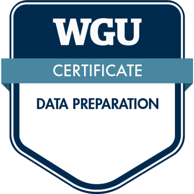
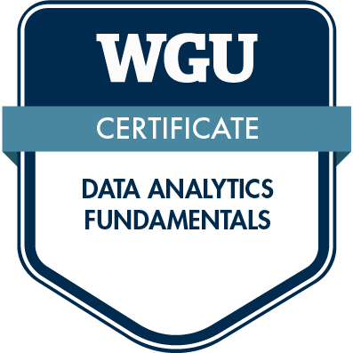
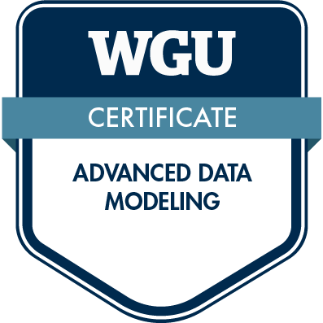

# WGU_Portfolio

This is a portfolio of my work in the Master of Science, Data Analysis (MSDA) degree program at Western Governors University. I completed my education to make a career change into data analytics/science, and this portfolio showcases that work for prospective employers.

## Certificates
Along with the diploma for the M.S. Data Analytics degree, WGU also offered these certificates to show competency in various aspects of the data analytics lifecyle to students who've passed different courses to reflect these credentials.

 
 

